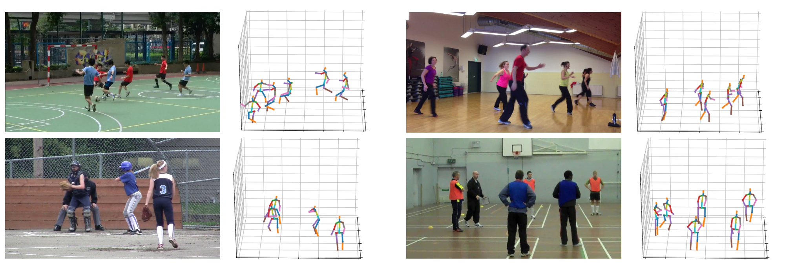

# GnTCN

[](https://paperswithcode.com/sota/3d-multi-person-pose-estimation-absolute-on?p=graph-and-temporal-convolutional-networks-for)

[](https://paperswithcode.com/sota/3d-multi-person-pose-estimation-root-relative?p=graph-and-temporal-convolutional-networks-for)

[](https://paperswithcode.com/sota/root-joint-localization-on-human3-6m?p=graph-and-temporal-convolutional-networks-for)

## Introduction

This repository contains the code and models for the following paper. 

> [Graph and Temporal Convolutional Networks for 3D Multi-person Pose Estimation in Monocular Videos](https://arxiv.org/pdf/2012.11806v3.pdf)  
> Cheng Yu, Bo Wang, Bo Yang, Robby T. Tan  
> AAAI Conference on Artificial Intelligence, AAAI 2021.

<p align="center"></p>

## Installation

### Dependencies
[Pytorch](https://pytorch.org/) >= 1.3<br>
Python >= 3.6<br>

Create an enviroment. 
```
conda create -n gntcn python=3.6
conda activate gntcn
```
Install the latest version of pytorch (tested on pytorch 1.3 - 1.7) based on your OS and GPU driver installed following [install pytorch](https://pytorch.org/). For example, command to use on Linux with CUDA 11.0 is like:
```
conda install pytorch torchvision cudatoolkit=11.0 -c pytorch
```

Install opencv-python, torchsul, and tqdm
```
pip install opencv-python
pip install --upgrade torchsul 
pip install tqdm
```

## Pre-trained Model

Download the pre-trained model and processed human keypoint files (H36M and MuPoTS) [here](https://www.dropbox.com/s/3ml0s7wfz57z3oq/tgcn_data.zip?dl=0), and unzip to this project's directory.

## Usage

#### Run evaluation on Human3.6M dataset with 2D Ground-truth as input

As 2D joint estimator is not included in this repo, the following evaluation code takes 2D Ground-truth joints as input to simulate the situation when there is no error in 2D estimator, how GnTCN performs. Please note the MPJPE value from this evaluation is lower than the one reported in Table 5 because 2D estimotor was used for the results in Table 5. 

If GPU is available and pytorch is installed successfully, the GPU evaluation code can be used,
```
python eval_gt_h36m.py
```

If GPU is not available or pytorch is not successfully installed, the CPU evaluation code can be used,
```
python eval_gt_h36m_cpu.py
```

#### Run evaluation on MuPoTS dataset with 2D Ground-truth as input 

The 2D points are included in the data package. To evaluate with GPU:
```
python calculate_mupots.py
python eval_mupots.py
```

## Citation

If this work is useful for your research, please cite our paper. 
```
@article{cheng2020graph,
  title={Graph and Temporal Convolutional Networks for 3D Multi-person Pose Estimation in Monocular Videos},
  author={Cheng, Yu and Wang, Bo and Yang, Bo and Tan, Robby T},
  journal={AAAI},
  year={2021}
}
```
